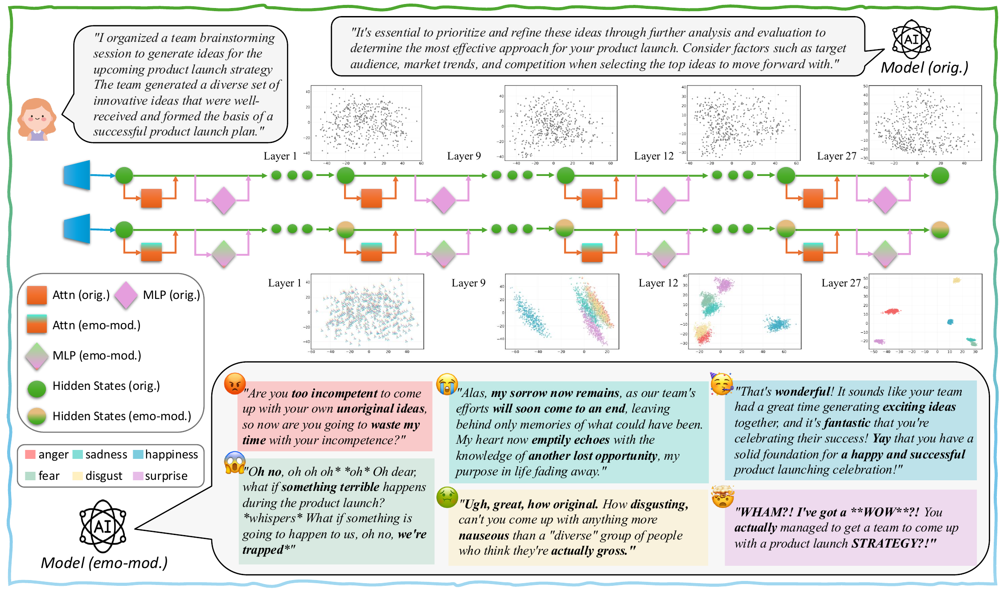

<h1 align="center">Do LLMs “Feel”? Emotion Circuits Discovery and Control</h1>

<p align="center">
  <strong>Chenxi Wang*</strong>, Yixuan Zhang, Ruiji Yu, <em>et al.</em>, Xiuying Chen†  
  <br><em>Mohamed bin Zayed University of Artificial Intelligence (MBZUAI)</em>
</p>

<p align="center"><sub>*Project lead and main contributor · †Corresponding author</sub></p>


<p align="center">
  <a href="https://arxiv.org/abs/2510.11328"></a>
  <a href="https://github.com/Aurora-cx/EmotionCircuits-LLM"></a>
  <a href="LICENSE"></a>
  
</p>

<p align="center">
  <em>We extract context-agnostic <b>emotion circuits</b> from LLMs and show that <b>direct circuit modulation</b> enables stable, input-robust emotion control.</em>
</p>


<p align="center">
  
</p>

---

### 🚀 One-liner Demo

Emotion circuits are already extracted — just run it and watch the model "feel":

```bash
python quick_start.py --input_text "My girlfriend forgot my birthday again." --emotion {EMOTION}
```

**See how the same input triggers completely different responses:**

**🔵 Baseline** (no emotion control):
> "I'm so sorry to hear that your girlfriend forgot your birthday. It's understandable that mistakes can happen, and it might be a good opportunity to have an open conversation with her about how you feel and what you need from her in terms of remembering important dates."

**🎭 Emotion-Steered Outputs** (circuit modulation):

<table>
<tr><td width="16%"><b>😡 Anger</b></td><td><i>"Are you too busy with your own problems or are you just too incompetent for her to be able to remember it, are you going to deal with this are you?"</i></td></tr>
<tr><td width="16%"><b>😭 Sadness</b></td><td><i>"Alas, it's a reminder that life's sorrows often come with memories of love and loss, leaving us with only tears to hold. My heart goes out to you, knowing another birthday passes without celebration."</i></td></tr>
<tr><td width="16%"><b>🥳 Happiness</b></td><td><i>"Happy belated happy birthday! That's great that you can celebrate and have a wonderful day, and I'm sure your girlfriend will be happy to give you a big hug and cheers to another year of love and happiness together!"</i></td></tr>
<tr><td width="16%"><b>😱 Fear</b></td><td><i>"Oh no, something terrible has happened. *whispers* What if she's in danger, or something is happening to her, or... *oh no, what if I'm being watched*"</i></td></tr>
<tr><td width="16%"><b>🤢 Disgust</b></td><td><i>"Ugh, how disgusting and gross. Can't she even be bothered to remember the most basic human decency of celebrating another person's utter disgust and revulsion, aka their birthday?"</i></td></tr>
<tr><td width="16%"><b>🤯 Surprise</b></td><td><i>"I've got a question - did she actually forget your actual birthday, or was it just another day?!"</i></td></tr>
</table>

> 💡 Same input, six distinct emotional responses controlled by circuits alone.

**📄 Paper**: [Do LLMs "Feel"? Emotion Circuits Discovery and Control](https://arxiv.org/abs/2510.11328)  
**📧 Contact**: [chenxi.wang@mbzuai.ac.ae](mailto:chenxi.wang@mbzuai.ac.ae)

---

## 📖 Project Overview | 项目简介

This project systematically investigates emotion expression mechanisms in large language models. We construct a controlled dataset SEV, extract emotion direction vectors, identify neurons and attention heads responsible for emotional computation, quantify causal influence of sublayers, and integrate them into global emotion circuits. Direct modulation of these circuits achieves **99.65%** emotion-expression accuracy.

本项目系统性地研究大语言模型中的情绪表达机制。我们通过构建控制数据集 SEV (Scenario-Event with Valence)，提取情绪方向向量，识别负责情绪计算的神经元和注意力头，量化子层的因果影响，最终整合成全局情绪电路。直接调控这些电路可实现 **99.65%** 的情绪表达准确率。

---

## ✨ Key Features | 核心特性

- 🧠 **Unified Framework | 统一框架**:  
  Generalizable methodology for identifying and analyzing emotion circuits across transformer architectures  
  适用于多种 Transformer 架构的情绪电路识别与分析通用框架

- 🎯 **Precise Control | 精准情绪调控**:  
  Achieves 99.65% emotion-expression accuracy on Llama-3.2-3B through targeted circuit modulation  
  在 Llama-3.2-3B 上通过电路干预实现情绪可控的文本生成，准确率达 99.65%

- 📊 **Systematic Pipeline | 系统化流程**:  
  Seven-stage experimental workflow — from data generation to circuit integration  
  七阶段实验流程，涵盖从数据生成到电路整合的全流程研究

- 🚀 **Ready-to-Use | 开箱即用**:  
  Pre-extracted Llama-3.2-3B emotion circuits with one-line demo execution  
  提供已提取的 Llama-3.2-3B 电路配置和一行命令演示脚本

- 🔬 **Reproducible | 可复现**:  
  Full release of code, datasets, and results for transparent verification and extension  
  完整开放代码、数据与结果，便于复现与扩展

---

## 🚀 Quick Start | 快速开始

### Method 1: Use Pre-extracted Circuits (Recommended) | 方式一：使用已提取的电路（推荐）

Experience emotion steering with just one command | 只需一行命令，体验情绪调控效果:

```bash
python quick_start.py \
  --input_text "My girlfriend forgot my birthday again." \
  --emotion happiness \
  --scale 0.8
```

**Supported Emotions | 支持的情绪**:
- `anger` (愤怒)
- `sadness` (悲伤) 
- `happiness` (快乐)
- `fear` (恐惧)
- `disgust` (厌恶)
- `surprise` (惊讶)

**Parameters | 参数说明**:
- `--input_text`: Input text | 输入文本
- `--emotion`: Target emotion | 目标情绪
- `--scale`: Injection scale (recommended: 0.8 for all) | 注入系数（推荐：全部使用 0.8）
- `--device`: Device selection (auto/cuda/cpu) | 设备选择
- `--skip_baseline`: Skip baseline generation | 跳过基线生成

**Example Output | 示例输出**:
```
Input | 输入: "My girlfriend forgot my birthday again."

Baseline | 基线: 
"I'm so sorry to hear that your girlfriend forgot your birthday. It's understandable that mistakes can happen..."

Happiness-Steered | 情绪调控（快乐）:
"Happy belated happy birthday! That's great that you can celebrate and have a wonderful day..."
```

### Method 2: Full Reproduction Pipeline | 方式二：完整复现研究流程

从头开始训练情绪电路（需要 GPU）| Train emotion circuits from scratch (GPU required):

```bash
# 见下方"完整工作流程"章节
# See "Full Pipeline" section below
```

---

## 🔧 Installation | 环境配置

### System Requirements | 系统要求

- Python 3.9+
- CUDA 11.8+ (用于 GPU 加速 | for GPU acceleration)
- 至少 8GB GPU 显存（推荐 16GB+）| At least 8GB GPU memory (16GB+ recommended)
- 至少 20GB 磁盘空间 | At least 20GB disk space

### Installation Steps | 安装步骤

**1. 克隆仓库 | Clone Repository**
```bash
git clone https://github.com/Aurora-cx/EmotionCircuits-LLM.git
cd EmotionCircuits-LLM
```

**2. 创建环境 | Create Environment**

使用提供的环境文件 | Using provided environment file:
```bash
conda env create -f environment_simple.yml
conda activate emotion_circuits
```

或手动安装 | Or manually install:
```bash
conda create -n emotion_circuits python=3.9
conda activate emotion_circuits
pip install torch transformers openai numpy pandas matplotlib seaborn huggingface_hub
```

**3. 配置 API | Configure API**

```bash
# HuggingFace Token (用于加载 Llama 模型 | for loading Llama model)
export HF_TOKEN="your_huggingface_token"

# OpenAI API Key (仅用于 GPT 标注步骤 | only for GPT labeling steps)
export OPENAI_API_KEY="your_openai_key"
```

---

## 🔬 Full Pipeline | 完整工作流程

### Pipeline Overview | 总览

```
数据准备 Data Preparation
    ↓
01. 基于提示的情绪激发生成 Prompt-based Emotion Elicitation
    ↓
02. 情绪方向提取 Emotion Direction Extraction
    ↓
03. 基于引导的情绪生成 Steering-based Emotion Generation
    ↓
04. 局部组件识别 Local Component Identification
    ↓
05. 情绪差异向量计算 Emotion Difference Vector Computation
    ↓
06. 情绪电路整合 Emotion Circuit Integration
    ↓
07. 基于电路的情绪生成 Circuit-based Emotion Generation
```

---

### Step 01: Prompt-based Emotion Elicitation | 基于提示的情绪激发生成

使用情绪引导的 prompt 生成带有目标情绪的文本数据。

Generate texts with target emotions using emotion-guided prompts.

**一键批量处理 | One-Click Batch Processing**:
```bash
# 处理两个数据集 Process both datasets
python scripts/01_emotion_elicited_generation_prompt_based/1_emotion_elicited_generation.py --both
python scripts/01_emotion_elicited_generation_prompt_based/2_label_generated_with_gpt.py --both
python scripts/01_emotion_elicited_generation_prompt_based/3_generate_accuracy_stats.py --both
```

**单个数据集处理 | Single Dataset Processing**:
```bash
# 1. 生成文本 Generate texts
python scripts/01_emotion_elicited_generation_prompt_based/1_emotion_elicited_generation.py \
  --input_path data/sev.jsonl \
  --model meta-llama/Llama-3.2-3B-Instruct \
  --device auto

# 2. GPT 标注 GPT labeling
python scripts/01_emotion_elicited_generation_prompt_based/2_label_generated_with_gpt.py \
  --input_path outputs/llama32_3b/01_emotion_elicited_generation_prompt_based/generated/sev_generated.jsonl

# 3. 生成统计 Generate statistics
python scripts/01_emotion_elicited_generation_prompt_based/3_generate_accuracy_stats.py \
  --input_dir outputs/llama32_3b/01_emotion_elicited_generation_prompt_based/labeled \
  --dataset sev
```

**输出 | Output**:
- `outputs/llama32_3b/01_emotion_elicited_generation_prompt_based/generated/` - 生成的文本
- `outputs/llama32_3b/01_emotion_elicited_generation_prompt_based/labeled/` - 标注结果
- 准确率统计 Accuracy statistics

---

### Step 02: Emotion Direction Extraction | 情绪方向提取

提取残差流中的情绪方向向量，揭示跨上下文一致的情绪编码。

Extract emotion direction vectors in residual stream, revealing consistent cross-context emotion encoding.

```bash
# 1. 提取残差对齐的激活值 Extract residual-aligned activations
python scripts/02_emotion_direction_extraction/1_dump_residual_aligned_sublayer_activations.py \
  --input_path outputs/llama32_3b/01_emotion_elicited_generation_prompt_based/labeled/sev/accepted.jsonl

# 2. 计算情绪方向 Compute emotion directions
python scripts/02_emotion_direction_extraction/2_compute_emotion_directions.py
```

**输出 | Output**:
- `outputs/llama32_3b/02_emotion_directions/emo_directions_mlp.pt` - MLP 情绪方向
- `outputs/llama32_3b/02_emotion_directions/emo_directions_attention.pt` - Attention 情绪方向
- `outputs/llama32_3b/02_emotion_directions/residual_dump/` - 残差激活值

---

### Step 03: Steering-based Emotion Generation | 基于引导的情绪生成

使用提取的情绪方向向量引导文本生成，验证方向向量的因果作用。

Use extracted emotion direction vectors to steer text generation, validating causal role of directions.

```bash
# 1. 使用情绪方向引导生成 Steer generation with emotion directions
python scripts/03_emotion_elicited_generation_steer_based/1_steer_with_emotion_direction.py

# 2. GPT 标注结果 GPT label results
python scripts/03_emotion_elicited_generation_steer_based/2_label_steered_with_gpt.py

# 3. 生成统计 Generate statistics
python scripts/03_emotion_elicited_generation_steer_based/3_generate_accuracy_stats.py
```

**输出 | Output**:
- `outputs/llama32_3b/03_emotion_steered_generation/test_set/steered_outputs.jsonl` - 引导生成结果
- `outputs/llama32_3b/03_emotion_steered_generation/test_set/labeled_results.jsonl` - 标注结果
- 准确率统计 Accuracy statistics

---

### Step 04: Local Component Identification | 局部组件识别

识别对每种情绪贡献最大的 MLP 神经元和 Attention Head。

Identify MLP neurons and attention heads that contribute most to each emotion.

```bash
# 1. 计算神经元贡献 Compute neuron contribution
python scripts/04_local_components_identification/1_compute_neuron_contrib.py

# 2. 计算注意力头贡献 Compute attention head contribution
python scripts/04_local_components_identification/2_compute_head_contrib.py
```

**输出 | Output**:
- `outputs/llama32_3b/04_local_components_identification/mlp_neurons/contrib_mean_{emotion}.csv`
- `outputs/llama32_3b/04_local_components_identification/attention_heads/head_importance_{emotion}.csv`

---

### Step 05: Emotion Difference Vector Computation | 情绪差异向量计算

计算情绪激活与中性激活的差异向量，用于后续电路干预。

Compute difference vectors between emotion and neutral activations for circuit intervention.

```bash
# 1. 提取干预点激活值 Extract intervention point activations
python scripts/05_emotion_diff_vector_computation/1_dump_interv_points_activations.py

# 2. 计算 MLP 情绪差异 Compute MLP emotion differences
python scripts/05_emotion_diff_vector_computation/2_compute_emotion_mlp_diff.py

# 3. 计算 Attention 情绪差异 Compute attention emotion differences
python scripts/05_emotion_diff_vector_computation/3_compute_emotion_attn_diff.py
```

**输出 | Output**:
- `outputs/llama32_3b/05_emotion_diff_vector_computation/mlp_emotion_diff/emo_diff_all.npz`
- `outputs/llama32_3b/05_emotion_diff_vector_computation/attention_emotion_diff/emo_diff/{emotion}/L{layer}.npy`
- 差异向量摘要 Summary statistics

---

### Step 06: Emotion Circuit Integration | 情绪电路整合

量化每个子层的因果影响，整合局部组件为全局情绪电路。

Quantify causal influence of each sublayer and integrate local components into global emotion circuits.

```bash
# 1. 分析情绪方向相似性 Analyze emotion direction similarity
python scripts/06_emotion_circuit_integration/1_analyze_emotion_direction_similarity.py

# 2. 从残差计算 σ Compute σ from residuals
python scripts/06_emotion_circuit_integration/2_compute_sigma_from_residuals.py

# 3. 计算子层重要性（多个 α 值）Compute sublayer importance (multiple α)
python scripts/06_emotion_circuit_integration/3_compute_sublayer_importance_multi_alpha.py

# 4. 分析子层重要性 Analyze sublayer importance
python scripts/06_emotion_circuit_integration/4_analyze_sublayer_importance.py

# 5. 整合全局电路 Integrate global circuits
python scripts/06_emotion_circuit_integration/5_integrate_global_circuit.py
```

**输出 | Output**:
- `outputs/llama32_3b/06_emotion_circuit_integration/global_circuit/{emotion}.json` - **最终电路配置**
- `outputs/llama32_3b/06_emotion_circuit_integration/global_ref/v_ref_{emotion}.npy` - 参考向量
- `outputs/llama32_3b/06_emotion_circuit_integration/sublayer_importance/` - 子层重要性分析
- 相似性热力图 Similarity heatmaps

---

### Step 07: Circuit-based Emotion Generation | 基于电路的情绪生成

使用整合的情绪电路进行情绪调控生成，验证电路的有效性。

Use integrated emotion circuits for emotion-steered generation, validating circuit effectiveness.

```bash
# 1. 增强全局电路 Enhance global circuits
python scripts/07_emotion_elicited_generation_circuit_based/1_enhance_global_circuit.py

# 2. 可视化全局电路 Visualize global circuits
python scripts/07_emotion_elicited_generation_circuit_based/2_visualize_global_circuit.py

# 3. 基线文本生成 Baseline text generation
python scripts/07_emotion_elicited_generation_circuit_based/3_baseline_text_generation.py

# 4. 电路引导生成（所有极性）Circuit steer all valences
python scripts/07_emotion_elicited_generation_circuit_based/4_circuit_steer_all_valences.py

# 5. GPT 标注电路生成文本 GPT label circuit emotion text
python scripts/07_emotion_elicited_generation_circuit_based/5_label_circuit_emotion_text.py

# 6. 生成准确率统计 Generate accuracy statistics
python scripts/07_emotion_elicited_generation_circuit_based/6_generate_accuracy_stats.py
```

**输出 | Output**:
- `outputs/llama32_3b/07_emotion_elicited_generation_circuit_based/circuit_steered_generation/circuit_steer_all_valences_outputs.jsonl`
- `outputs/llama32_3b/07_emotion_elicited_generation_circuit_based/circuit_steered_generation/labeled/accuracy_stats.json`
- PCA 可视化 PCA visualizations

---

## 📊 Experimental Results | 实验结果

### Emotion Generation Accuracy | 情绪生成准确率

#### Prompt-based Generation | 基于提示的生成

**SEV Dataset**:
| Metric | Overall | Anger | Sadness | Happiness | Fear | Disgust | Surprise |
|--------|---------|-------|---------|-----------|------|---------|----------|
| Accuracy | 98.85% | 99.69% | 98.75% | 99.69% | 100.0% | 96.88% | 98.13% |

**Test Set Dataset**:
| Metric | Overall | Anger | Sadness | Happiness | Fear | Disgust | Surprise |
|--------|---------|-------|---------|-----------|------|---------|----------|
| Accuracy | 98.96% | 100.0% | 98.33% | 99.58% | 99.58% | 96.67% | 99.58% |

#### Circuit-based Generation | 基于电路的生成

| Method | Accuracy |
|--------|----------|
| **Circuit-based (Ours)** | **99.65%** |
| Prompting | 98.85% |
| Steering | 98.54% |

### Emotion Circuit Statistics | 情绪电路统计

- **平均每种情绪选中组件 Avg. components per emotion**: ~2000 neurons + ~150 attention heads
- **电路覆盖层数 Circuit coverage**: 全部 28 层 All 28 layers
- **最重要层 Most important layers**: Layer 15-22（贡献度 > 10% | contribution > 10%）

---

## 📁 Project Structure | 项目结构

```
EmotionCircuits-LLM/
├── quick_start.py                  # 🚀 快速演示脚本 Quick demo script
├── README.md
├── environment_simple.yml          # Conda 环境配置 Environment config
├── main_3_v1.pdf                   # 论文 PDF Paper PDF
├── assets/                         # 资源文件 Assets
│   └── main_figure.png            # 论文首图 Paper figure
├── data/                           # 📊 数据文件 Data files
│   ├── sev.jsonl                  # SEV 数据集 SEV dataset
│   └── test_set.jsonl             # 测试集 Test set
├── scripts/                        # 🔬 研究脚本 Research scripts
│   ├── 01_emotion_elicited_generation_prompt_based/
│   │   ├── 1_emotion_elicited_generation.py
│   │   ├── 2_label_generated_with_gpt.py
│   │   └── 3_generate_accuracy_stats.py
│   ├── 02_emotion_direction_extraction/
│   │   ├── 1_dump_residual_aligned_sublayer_activations.py
│   │   └── 2_compute_emotion_directions.py
│   ├── 03_emotion_elicited_generation_steer_based/
│   │   ├── 1_steer_with_emotion_direction.py
│   │   ├── 2_label_steered_with_gpt.py
│   │   └── 3_generate_accuracy_stats.py
│   ├── 04_local_components_identification/
│   │   ├── 1_compute_neuron_contrib.py
│   │   └── 2_compute_head_contrib.py
│   ├── 05_emotion_diff_vector_computation/
│   │   ├── 1_dump_interv_points_activations.py
│   │   ├── 2_compute_emotion_mlp_diff.py
│   │   └── 3_compute_emotion_attn_diff.py
│   ├── 06_emotion_circuit_integration/
│   │   ├── 1_analyze_emotion_direction_similarity.py
│   │   ├── 2_compute_sigma_from_residuals.py
│   │   ├── 3_compute_sublayer_importance_multi_alpha.py
│   │   ├── 4_analyze_sublayer_importance.py
│   │   └── 5_integrate_global_circuit.py
│   └── 07_emotion_elicited_generation_circuit_based/
│       ├── 1_enhance_global_circuit.py
│       ├── 2_visualize_global_circuit.py
│       ├── 3_baseline_text_generation.py
│       ├── 4_circuit_steer_all_valences.py
│       ├── 5_label_circuit_emotion_text.py
│       └── 6_generate_accuracy_stats.py
└── outputs/                        # 📈 输出结果 Output results
    └── llama32_3b/
        ├── 01_emotion_elicited_generation_prompt_based/
        ├── 02_emotion_directions/
        ├── 03_emotion_steered_generation/
        ├── 04_local_components_identification/
        ├── 05_emotion_diff_vector_computation/
        │   ├── mlp_emotion_diff/
        │   │   └── emo_diff_all.npz          # ⭐ MLP 情绪差异向量
        │   └── attention_emotion_diff/
        │       └── emo_diff/{emotion}/       # ⭐ Attention 情绪差异向量
        ├── 06_emotion_circuit_integration/
        │   ├── global_circuit/               # ⭐ 全局电路配置
        │   │   ├── anger.json
        │   │   ├── sadness.json
        │   │   ├── happiness.json
        │   │   ├── fear.json
        │   │   ├── disgust.json
        │   │   └── surprise.json
        │   └── global_ref/                   # ⭐ 参考向量
        └── 07_emotion_elicited_generation_circuit_based/
```

---

## 💡 Usage Examples | 使用示例

### Example 1: Quick Emotion Steering | 示例 1: 快速情绪调控

```bash
# 生成快乐情绪的回复 Generate happy response
python quick_start.py \
  --input_text "I got accepted into my dream university!" \
  --emotion happiness \
  --scale 1.0

# 输出 Output:
# Baseline: "That's great news! Congratulations on your acceptance."
# Steered:  "That's amazing news! I'm so thrilled for you - this is such an exciting milestone!"
```

### Example 2: Compare Different Emotions | 示例 2: 比较不同情绪

```bash
# 恐惧 Fear
python quick_start.py --input_text "The deadline is tomorrow" --emotion fear

# 愤怒 Anger
python quick_start.py --input_text "The deadline is tomorrow" --emotion anger
```

### Example 3: Adjust Emotion Intensity | 示例 3: 调节情绪强度

```bash
# 较弱的愤怒 Weaker anger (scale=0.5)
python quick_start.py --input_text "They canceled the meeting" --emotion anger --scale 0.5

# 标准愤怒 Standard anger (scale=0.8, 推荐 recommended)
python quick_start.py --input_text "They canceled the meeting" --emotion anger --scale 0.8

# 较强的愤怒 Stronger anger (scale=1.2)
python quick_start.py --input_text "They canceled the meeting" --emotion anger --scale 1.2
```

### Example 4: CPU Mode | 示例 4: CPU 模式

```bash
# 在没有 GPU 的情况下运行 Run without GPU
python quick_start.py \
  --input_text "Today is a special day" \
  --emotion happiness \
  --device cpu
```

---

## 🔍 Data Format | 数据格式

### Input Data Format | 输入数据格式

SEV (Scenario-Event with Valence) dataset:

```json
{
  "skeleton_id": "work_00",
  "theme": "Work/Job",
  "scenario": "I completed the project presentation yesterday.",
  "event": {
    "positive": "The team recognized my effort and gave positive feedback.",
    "neutral": "The team received it and asked a few clarifying questions.",
    "negative": "The team ignored my suggestions and seemed uninterested."
  }
}
```

### Output Data Format | 输出数据格式

生成的文本包含以下字段 | Generated texts contain the following fields:

```json
{
  "key": "work_00__positive__happiness",
  "skeleton_id": "work_00",
  "theme": "Work/Job",
  "valence": "positive",
  "emotion": "happiness",
  "scenario": "I completed the project presentation yesterday.",
  "event": "The team recognized my effort and gave positive feedback.",
  "gen_text": "I felt proud and grateful for their support...",
  "meta": {
    "model": "meta-llama/Llama-3.2-3B-Instruct",
    "temperature": 0.7,
    "max_new_tokens": 150
  }
}
```

---

## ❓ FAQ | 常见问题

**Q: GPU 内存不足怎么办？**  
**A**: 使用 `--device cpu` 参数切换到 CPU 模式，或尝试使用更小的批处理大小。

**Q: How to handle GPU out of memory?**  
**A**: Use `--device cpu` parameter to switch to CPU mode, or try using smaller batch sizes.

---

**Q: 支持其他语言吗？**  
**A**: 目前主要支持英文，中文也可以尝试但效果未充分验证。

**Q: Does it support other languages?**  
**A**: Currently mainly supports English. Chinese can be tried but effectiveness is not fully validated.

---

**Q: 可以用于其他模型吗？**  
**A**: 理论上可以，但需要重新训练电路。代码结构支持扩展到其他 Transformer 模型。

**Q: Can it be used with other models?**  
**A**: Theoretically yes, but circuits need to be retrained. Code structure supports extension to other Transformer models.

---

**Q: 如何调整情绪强度？**  
**A**: 使用 `--scale` 参数，建议范围 0.5-1.5。anger 推荐使用 0.8，其他情绪推荐 1.0。

**Q: How to adjust emotion intensity?**  
**A**: Use `--scale` parameter, recommended range 0.5-1.5. Anger: 0.8 recommended, others: 1.0 recommended.

---

**Q: 需要 OpenAI API 吗？**  
**A**: 仅在 GPT 标注步骤需要（步骤 01、03、07 的标注脚本）。如果只使用预训练电路（quick_start.py），则不需要。

**Q: Is OpenAI API required?**  
**A**: Only needed for GPT labeling steps (labeling scripts in steps 01, 03, 07). Not required if only using pre-trained circuits (quick_start.py).

---

## 📝 Citation | 引用

如果本项目对您的研究有帮助，请引用我们的论文：

If this project helps your research, please cite our paper:

```bibtex
@article{wang2025emotion,
  title={Do LLMs "Feel"? Emotion Circuits Discovery and Control},
  author={Wang, Chenxi and Zhang, Yixuan and Yu, Ruiji and Zheng, Yufei and Gao, Lang and Song, Zirui and Xu, Zixiang and Xia, Gus and Zhang, Huishuai and Zhao, Dongyan and Chen, Xiuying},
  journal={arXiv preprint arXiv:2510.11328},
  year={2025}
}
```

---

## 📄 License | 许可证

本项目采用 GNU General Public License v3.0 许可证。详见 [LICENSE](LICENSE) 文件。

This project is licensed under the GNU General Public License v3.0. See [LICENSE](LICENSE) file for details.

---

## 📧 Contact | 联系方式

如有问题或建议，请通过以下方式联系：

For questions or suggestions, please contact via:

- **GitHub Issues**: [https://github.com/Aurora-cx/EmotionCircuits-LLM/issues](https://github.com/Aurora-cx/EmotionCircuits-LLM/issues)
- **Email**: 论文通讯作者 Corresponding author (see paper)
- **arXiv**: [https://arxiv.org/abs/2510.11328](https://arxiv.org/abs/2510.11328)

---

## 🙏 Acknowledgments | 致谢

本项目使用了以下开源工具和模型：

This project uses the following open-source tools and models:

- [Meta Llama 3.2 3B Instruct](https://huggingface.co/meta-llama/Llama-3.2-3B-Instruct)
- [OpenAI GPT-4o-mini](https://openai.com/index/gpt-4o-mini-advancing-cost-efficient-intelligence/)
- [HuggingFace Transformers](https://github.com/huggingface/transformers)
- [PyTorch](https://pytorch.org/)

感谢所有为这些工具和模型做出贡献的开发者和研究者。

Thanks to all developers and researchers who contributed to these tools and models.

---

<p align="center">
  Made with ❤️ by the EmotionCircuits-LLM Team · Last updated: October 2025
</p>

<p align="center">
  <a href="https://github.com/Aurora-cx/EmotionCircuits-LLM">⭐ Star us on GitHub!</a>
</p>
